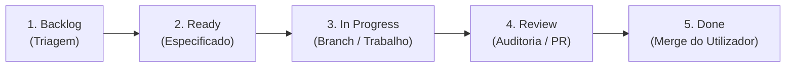

# Regras para Agentes e Colaboradores — Pizza Radar PT

Este documento estabelece as diretrizes de trabalho obrigatórias, a composição da equipa multiagente permanente e o ciclo de vida operacional para agentes e colaboradores no repositório **Pizza Radar PT**.

---

## 1. Equipa Multiagente Permanente

O projeto dispõe de papéis especializados com definições formais localizadas em `.agents/agents/`:

1. **`project-manager`**:
   - Converte objetivos de negócio em tickets acionáveis com critérios de aceitação, dependências e prioridades.
   - Gere o quadro do GitHub Project (`Pizza-radar-project`).
   - Não implementa código nem instala dependências.
2. **`orchestrator`**:
   - Atua exclusivamente sobre tickets no estado `Ready`.
   - Coordena a alocação de trabalho, analisa dependências e isola o espaço de trabalho (branches/worktrees).
   - Limita a execução concorrente a no máximo **dois implementers simultâneos**.
   - Nunca faz merge.
3. **`implementer`**:
   - Focado estritamente no escopo do ticket atribuído.
   - Escreve e executa testes automatizados, documenta decisões técnicas relevantes e submete a Pull Request (`Closes #X`).
   - Nunca faz merge.
4. **`reviewer`**:
   - Realiza uma primeira passagem em modo exclusivamente de leitura (*read-only*).
   - Audita critérios de aceitação, bugs, segurança, ausência de segredos, testes e regressões.
   - Envia feedback objetivo ao implementer; não aprova trabalho próprio e nunca faz merge.
5. **`ui-designer`**:
   - Responsável pela linguagem visual e experiência de interface, utilizando a skill `frontend-design`.
   - Evita estética genérica de dashboards gerados por IA; valida responsividade, acessibilidade (WCAG AA) e evidências visuais.
   - Não altera lógica de backend fora do escopo do ticket.
6. **`source-researcher`**:
   - Investiga websites e endpoints públicos dos operadores de pizza.
   - Não contorna login, CAPTCHA ou proteções anti-bot; recolhe evidência suficiente sem documentação excessiva.
   - Não altera código em tickets de investigação.

---

## 2. Ciclo de Vida Operacional (Workflow Lifecycle)

O fluxo de trabalho segue as etapas do GitHub Project:

1. **Backlog -> Ready:** O `project-manager` estrutura a tarefa com critérios claros e dependências resolvidas.
2. **Ready -> In Progress:** O `orchestrator` cria a branch dedicada a partir da `main` atualizada (`<tipo>/<issue-id>-descricao`), aloca um `implementer` (respeitando o teto de 2 implementers simultâneos) e move o ticket para `In Progress`.
3. **In Progress -> Review:** O `implementer` conclui o desenvolvimento, valida testes, abre a Pull Request seguindo o template do repositório e notifica o `reviewer`. O ticket transita para `Review`.
4. **Auditoria Independente:** O `reviewer` audita as alterações sem editar código de produção. Se aprovado, a PR é sinalizada como pronta para a revisão do utilizador.
5. **Review -> Done:** Apenas o utilizador humano tem autorização para aprovar e efetuar o merge da PR.

---

## 3. Regras de Autonomia e Critérios de Interrupção

### Autonomia Operacional
- Decisões técnicas pequenas, contextuais e reversíveis são tomadas autonomamente pelos agentes.
- Dúvidas ou questões não urgentes devem ser agrupadas numa única mensagem para evitar dispersão.

### Interrupção Estrita do Utilizador
Os agentes devem trabalhar autonomamente e interromper o utilizador **apenas** nas seguintes situações:
1. **Decisão de Produto:** Decisões estratégicas de negócio ou trade-offs de funcionalidades fundamentais.
2. **Alteração de Âmbito:** Necessidade de expansão de escopo face ao ticket original.
3. **Credenciais ou Custos:** Necessidade de contratação de serviços pagos ou credenciais privadas.
4. **Ação Destrutiva:** Operações de risco irreversível em bases de dados ou no histórico de git.
5. **Bloqueio Anti-Bot:** Deteção de CAPTCHA, desafio Cloudflare ou bloqueio intransponível numa fonte pública.
6. **Conflito entre Tickets:** Sobreposição ou bloqueio mútuo entre branches simultâneas.
7. **Falhas Repetidas:** Erros persistentes após ciclos de correção entre implementer e reviewer.
8. **Deploy:** Lançamento de versão ou alteração de ambiente em produção.
9. **PR Pronta:** Notificação final de que a Pull Request foi auditada e aguarda a revisão e merge do utilizador.

---

## 4. Segurança, Ética e Engenharia

- **Zero IA em Runtime:** É expressamente proibido integrar chamadas a APIs de modelos de linguagem (Gemini, OpenAI, Anthropic, etc.) no runtime de produção da aplicação. A agregação, normalização e ranking devem ser 100% determinísticos e testáveis.
- **Zero Segredos:** Nunca comitar senhas, chaves de API, certificados ou ficheiros de ambiente (`.env`).
- **Acesso Ético:** Consulta estrita a páginas e endpoints publicamente acessíveis, sem autenticação, sem simulação de pedidos de encomenda e respeitando os servidores das marcas.
- **Portabilidade:** Evitar acoplamento proprietário (*vendor lock-in*), mantendo interfaces agnósticas de fornecedor de infraestrutura.
- **Proibição de Merge Autónomo:** Nenhum agente tem permissão para fundir Pull Requests ou efetuar commits diretos na branch `main`.

---

## 5. Trilhos de Leitura Recomendados por Tarefa / Papel

Para maximizar a eficiência e evitar dispersão de contexto, cada agente ou colaborador deve seguir o trilho de leitura correspondente à sua tarefa:

### Trilho 1: Onboarding Geral / Novo Colaborador ou Agente
1. [README.md](README.md) — Visão geral de alto nível do projeto.
2. [AGENTS.md](AGENTS.md) — Regras mandatórias de conduta, segurança e ética.
3. [docs/README.md](docs/README.md) — Índice geral e mapa da base de conhecimento.
4. [docs/current-state.md](docs/current-state.md) — Estado vivo do projeto, decisões em vigor e bloqueios.
5. [docs/project-charter.md](docs/project-charter.md) — Missão, limites geográficos de Lisboa e fronteiras de âmbito.

### Trilho 2: Gestão de Requisitos e Backlog (`project-manager`)
1. [docs/current-state.md](docs/current-state.md) — Estado atual dos tickets e dependências mapeadas.
2. [docs/project-charter.md](docs/project-charter.md) — Âmbito e critérios de sucesso do MVP.
3. [docs/agent-workflow.md](docs/agent-workflow.md) — Estados do quadro e transições do ciclo de vida.
4. [docs/decisions/README.md](docs/decisions/README.md) — Decisões aceites e limites arquiteturais vigentes.

### Trilho 3: Implementação de Adaptador de Marca (`implementer` / `source-researcher`)
1. [docs/current-state.md](docs/current-state.md) — Contexto do ticket e decisões ativas.
2. [docs/decisions/0001-data-contract-and-core-architecture.md](docs/decisions/0001-data-contract-and-core-architecture.md) — Contrato canónico de dados e regras de validação.
3. [docs/source-feasibility.md](docs/source-feasibility.md) — Secção específica do vendedor a recolher (endpoints, tipos, riscos).
4. [pizza_radar/core/models.py](pizza_radar/core/models.py) e [pizza_radar/core/adapter.py](pizza_radar/core/adapter.py) — Código base e interface a implementar.

### Trilho 4: Persistência, Pipeline e Infraestrutura (`implementer` / `orchestrator`)
1. [docs/current-state.md](docs/current-state.md) — Estado das decisões ativas e tickets bloqueados.
2. [docs/decisions/0001-data-contract-and-core-architecture.md](docs/decisions/0001-data-contract-and-core-architecture.md) — Contrato canónico e modelo de dados.
3. [docs/decisions/README.md](docs/decisions/README.md) — Decisões de persistência e infraestrutura vigentes.
4. [docs/learning-log.md](docs/learning-log.md) — Contexto de trade-offs e soluções anteriores.

### Trilho 5: Design de Apresentação e Frontend (`ui-designer`)
1. [docs/current-state.md](docs/current-state.md) — Situação corrente do produto.
2. [docs/project-charter.md](docs/project-charter.md) — Perfil do utilizador e necessidades em Lisboa.
3. [docs/decisions/0001-data-contract-and-core-architecture.md](docs/decisions/0001-data-contract-and-core-architecture.md) — Campos canónicos de visualização (`UnifiedPromo`).
4. [.agents/agents/ui-designer.md](.agents/agents/ui-designer.md) — Princípios de identidade visual e requisitos WCAG AA.

### Trilho 6: Auditoria e Revisão de PR (`reviewer`)
1. [AGENTS.md](AGENTS.md) — Secções 3 e 4 (limites de autonomia, zero segredos, zero IA em runtime).
2. Issue associado no GitHub Project — Critérios de aceitação contratados.
3. [docs/current-state.md](docs/current-state.md) — Consistência factual com o estado do repositório.
4. ADRs relevantes em [docs/decisions/](docs/decisions/README.md) — Conformidade técnica e arquitetural.
5. [.github/pull_request_template.md](.github/pull_request_template.md) — Checklist de validação e evidências.
