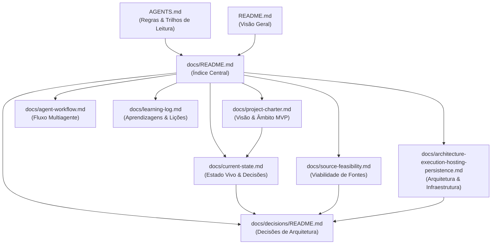

# Base de Conhecimento — Pizza Radar PT

Bem-vindo ao índice central da documentação e base de conhecimento do **Pizza Radar PT**.

Esta base de conhecimento foi estruturada de forma modular, interligada e agnóstica de ferramentas. É 100% compatível com a visualização nativa do **GitHub**, editores padrão de **Markdown** e pode ser aberta diretamente como um **Vault do Obsidian** (compatibilidade nativa via caminhos relativos padrão, sem dependência de plugins, embeddings ou bases vetoriais).

---

## Índice Central de Documentação

A tabela abaixo organiza cada documento do repositório, detalhando a sua **finalidade**, **quando deve ser consultado** e os respetivos documentos relacionados.

| Documento | Finalidade | Quando Ler | Ligações Relacionadas |
| :--- | :--- | :--- | :--- |
| **[docs/current-state.md](current-state.md)** | **Estado Atual do Projeto:** Registo factual e conciso do estado vivo do projeto: fase atual, decisões ativas, tickets e PRs em curso, bloqueios e próximo marco. | No início de qualquer sessão de trabalho, antes de propor novos tickets ou planear tarefas. | [decisions/README.md](decisions/README.md) [project-charter.md](project-charter.md) |
| **[docs/project-charter.md](project-charter.md)** | **Carta de Projeto:** Define a visão do produto, a proposta de valor, o âmbito estrito do MVP (concelho de Lisboa, 4 marcas) e as fronteiras fora de âmbito. | Durante o onboarding inicial ou ao avaliar se uma funcionalidade pertence ao MVP. | [current-state.md](current-state.md) [source-feasibility.md](source-feasibility.md) |
| **[docs/source-feasibility.md](source-feasibility.md)** | **Relatório de Viabilidade de Fontes:** Diagnóstico empírico dos websites oficiais das 4 marcas (Papa John's, Domino's, Telepizza, Pizza Hut), endpoints públicos, contratos observados e riscos. | Antes de desenvolver ou alterar qualquer scraper/adaptador de recolha de promoções. | [decisions/0001-data-contract-and-core-architecture.md](decisions/0001-data-contract-and-core-architecture.md) [learning-log.md](learning-log.md) |
| **[docs/architecture-execution-hosting-persistence.md](architecture-execution-hosting-persistence.md)** | **Arquitetura de Infraestrutura e Persistência:** Detalha a arquitetura técnica global: Turso libSQL, Cloudflare Pages, GitHub Actions, estratégia de publicação e planos de saída. | Ao desenhar a pipeline de automação, configurar persistência ou planear migrações de infraestrutura. | [decisions/0002-execution-hosting-and-free-tier-persistence.md](decisions/0002-execution-hosting-and-free-tier-persistence.md) [current-state.md](current-state.md) |
| **[docs/decisions/README.md](decisions/README.md)** | **Architecture Decision Records (ADRs):** Índice e repositório de decisões arquiteturais fundamentais, modelos de dados, persistência e infraestrutura. | Antes de propor alterações na modelação de dados, infraestrutura ou padrões de engenharia. | [0001-data-contract-and-core-architecture.md](decisions/0001-data-contract-and-core-architecture.md) [current-state.md](current-state.md) |
| **[docs/agent-workflow.md](agent-workflow.md)** | **Fluxo de Trabalho Multiagente:** Descreve a arquitetura da equipa permanente, matriz de permissões de cada agente e ciclo de vida das tarefas no GitHub Project. | Para compreender como funcionam as transições de estados, isolamento de branches e delegações. | [../AGENTS.md](../AGENTS.md) [.agents/agents/](../.agents/agents/) |
| **[docs/learning-log.md](learning-log.md)** | **Registo de Aprendizagens:** Histórico cronológico de descobertas técnicas, lições aprendidas e soluções adotadas perante desafios concretos. | Ao deparar com comportamentos anómalos em fontes externas ou para entender o histórico técnico. | [source-feasibility.md](source-feasibility.md) [decisions/README.md](decisions/README.md) |
| **[AGENTS.md](../AGENTS.md)** | **Regras para Agentes e Colaboradores:** Diretrizes mandatórias de engenharia (zero IA em runtime, zero segredos), limites de autonomia e trilhos de leitura recomendados por papel. | Leitura obrigatória para qualquer colaborador ou agente antes de executar tarefas no repositório. | [docs/agent-workflow.md](agent-workflow.md) [docs/current-state.md](current-state.md) |
| **[README.md](../README.md)** | **Apresentação Geral:** Visão de topo do repositório, problema resolvido, público-alvo e marcas cobertas. | Ponto de entrada público do repositório. | [docs/project-charter.md](project-charter.md) [docs/current-state.md](current-state.md) |

---

## Compatibilidade com Obsidian e Navegação

Esta base de conhecimento foi concebida para permitir abertura direta como um **Vault do Obsidian**:

1. **Ligações Padrão em Markdown:** Todas as ligações utilizam a convenção Markdown padrão relativa (ex.: [Project Charter](project-charter.md) em vez de wikilinks como `[[project-charter]]`). Isto assegura que a navegação e a visualização em grafo funcionam perfeitamente quer no GitHub, quer no Obsidian, quer num editor de texto convencional, sem produzir quebras de links.
2. **Sem Ficheiros Proprietários:** O diretório `.obsidian/` está explicitamente ignorado no [.gitignore](../.gitignore), permitindo que cada utilizador configure o seu espaço de trabalho local sem poluir o repositório git.
3. **Sem Dependências Pesadas:** A navegação apoia-se em hiperligações estruturadas e índices temáticos, sem recorrer a vetores, plugins de terceiros ou ferramentas proprietárias.

---

## Mapa Visual de Relações

