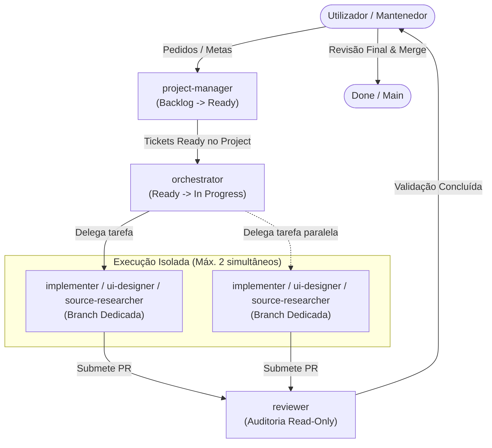

# Fluxo de Trabalho Multiagente — Pizza Radar PT

Este documento resume a arquitetura operacional da equipa multiagente permanente do **Pizza Radar PT**, detalhando os papéis, permissões e transições de ciclo de vida.

---

## 1. Visão Geral da Arquitetura de Agentes

A equipa opera de forma hierárquica e coordenada através do GitHub Project e do repositório Git:

---

## 2. Matriz de Agentes e Permissões

| Agente | Foco Principal | Permissões de Ficheiros | Ferramentas Autorizadas | Restrições Estritas |
| :--- | :--- | :--- | :--- | :--- |
| **`project-manager`** | Triagem, requisitos e gestão do quadro | Leitura de documentação | `gh issue`, `gh project`, `view_file` | Não cria nem altera código de aplicação; não faz merge. |
| **`orchestrator`** | Coordenação, worktrees e delegação | Gestão de branches e leitura | `invoke_subagent`, `git`, `view_file` | Máximo 2 implementers simultâneos; nunca programa diretamente nem faz merge. |
| **`implementer`** | Desenvolvimento de código e testes | Escrita completa no ticket | `write_to_file`, `replace_file_content`, `run_command` | Foco estrito no ticket; sem IA no runtime; nunca faz merge. |
| **`reviewer`** | Auditoria independente de qualidade e segurança | Exclusivamente leitura (*read-only*) | `view_file`, `git diff`, `git diff --check`, `run_command` (testes) | Não edita código de produto; não aprova trabalho próprio; nunca faz merge. |
| **`ui-designer`** | Direção visual, a11y e componentes UI | Escrita na camada de apresentação | `frontend-design`, `write_to_file`, `generate_image` | Evita dashboards genéricos de IA; não altera backend; nunca faz merge. |
| **`source-researcher`**| Investigação empírica de fontes públicas | Leitura e registo de relatórios | `read_url_content`, `search_web`, `curl` | Proibição de contornar CAPTCHA/anti-bot; sem código em spikes; nunca faz merge. |

---

## 3. Estados do Ciclo de Vida (Project Board)

1. **`Backlog`:** Ideias e pedidos brutos do utilizador em fase de refinamento pelo `project-manager`.
2. **`Ready`:** Tickets com especificação completa, critérios de aceitação e dependências resolvidas, prontos para consumo pelo `orchestrator`.
3. **`In Progress`:** Branch dedicada em desenvolvimento ativo por um `implementer` (máximo de 2 em paralelo).
4. **`Review`:** Pull Request aberta; o `reviewer` executa a auditoria independente de segurança, testes e critérios.
5. **`Done`:** Apenas atingido após a aprovação e merge executado manualmente pelo utilizador.

---

## 4. Diretrizes de Comunicação e Interrupção

- **Autonomia em Decisões Reversíveis:** Ajustes técnicos menores que não alterem o âmbito são decididos diretamente pelos agentes.
- **Agrupamento de Perguntas:** Dúvidas não bloqueantes são agregadas numa única mensagem.
- **Pontos de Escalação Obrigatória para o Humano:**
  - Alterações de âmbito ou decisões de produto;
  - Necessidade de credenciais ou custos;
  - Ações destrutivas (dados ou git);
  - Bloqueios anti-bot permanentes;
  - Conflitos insolúveis entre tickets;
  - Pull Request pronta para revisão final e merge.

---

## 5. Documentos Relacionados

- [Índice Central da Base de Conhecimento](README.md)
- [Regras para Agentes e Colaboradores](../AGENTS.md)
- [Estado Atual do Projeto](current-state.md)
- [Definições dos Agentes](../.agents/agents/)
