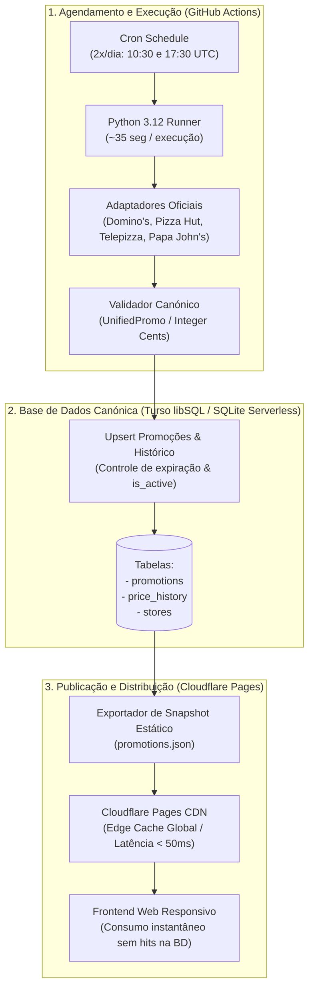

# Arquitetura de Execução, Alojamento, Base de Dados e Publicação — Pizza Radar PT

Este documento detalha a arquitetura técnica global do **Pizza Radar PT**, formalizando as decisões de infraestrutura, a seleção da base de dados com opção gratuita (*free-tier* real), o pipeline de agendamento determinístico, a estratégia de publicação com cache estática e o plano de portabilidade/saída de fornecedores.

---

## 1. Visão Geral da Arquitetura

O sistema adota uma arquitetura desacoplada, orientada a eventos periódicos e com separação estrita entre a camada de persistência/histórico (Base de Dados ACID) e a camada de consumo público (CDN Estática Global de alto desempenho):



---

## 2. Escolha e Racional dos Componentes de Infraestrutura

### 2.1. Alojamento Frontend: Cloudflare Pages
- **Decisão:** **Cloudflare Pages** para alojamento da aplicação web e distribuição estática.
- **Racional Técnico:**
  - **Free Tier sem Restrições Comerciais:** Disponibiliza largura de banda ilimitada, 500 builds por mês e tráfego ilimitado de requisições estáticas. Diferencia-se positivamente do Vercel Hobby (cujos Termos de Serviço restringem o uso estritamente a fins pessoais e não-comerciais).
  - **Edge Anycast Global:** Distribuição imediata em mais de 300 cidades mundiais (incluindo Lisboa), garantindo carregamento sub-50ms para utilizadores no concelho de Lisboa.
  - **SSL e Domínios Personalizados Gratuitos:** Suporte nativo para certificados SSL automáticos e configuração de domínio próprio sem custos adicionais.

### 2.2. Base de Dados: Turso (libSQL / SQLite Serverless)
- **Requisito Obrigatório:** O produto deve assentar numa base de dados relacional real para consistência, auditoria e histórico; ficheiros JSON estáticos funcionam como cache de publicação, não como substitutos da base de dados.
- **Avaliação Comparativa de Candidatos com Free Tier:**

| Fornecedor | Quota de Armazenamento | Quota de Operações | Política de Inatividade (Suspensão) | Veredito |
| :--- | :--- | :--- | :--- | :--- |
| **Turso (libSQL)** | **5 GB** | **500M leituras / 10M escritas/mês** | **Sem suspensão por inatividade** (Permanentemente ativa) | **ESCOLHIDO (Primário)** |
| **Supabase (PostgreSQL)** | 500 MB | Limitado por egress (5 GB) | **Pausa obrigatória após 7 dias sem queries SQL** | Rejeitado (risco de paragem do serviço) |
| **Neon (PostgreSQL)** | 500 MB | 100 CU-horas/mês | *Scale-to-zero* após 5 min (cold start de ~500ms) | Alternativa viável / Plano de Saída |
| **Cloudflare D1** | 5 GB | 5M leituras / 100k escritas/dia | Sem suspensão (acoplado a Cloudflare Workers) | Forte acoplamento ao ecossistema |

- **Racional da Escolha do Turso:**
  1. **Ausência de Desativação por Inatividade:** Elimina o problema crítico do Supabase Free, onde projetos são suspensos ao fim de 7 dias sem atividade SQL direta.
  2. **Compatibilidade SQL Padrão e Zero Lock-in:** O Turso utiliza o protocolo libSQL (fork aberto do SQLite). Em desenvolvimento local e na suíte de testes unitários, o sistema utiliza o motor `sqlite3` nativo da biblioteca padrão de Python sem necessidade de qualquer serviço em nuvem.
  3. **Dimensão e Quotas:** 5 GB de armazenamento e 10 milhões de escritas/mês cobrem largamente as necessidades do MVP (~150 promoções ativas em simultâneo, volume anual inferior a 5 MB).

### 2.3. Agendamento e Coletores: GitHub Actions
- **Mecanismo:** Workflow acionado por evento cronológico (`schedule: cron '30 10,17 * * *'`) duas vezes ao dia (10:30 UTC e 17:30 UTC), cobrindo os períodos anteriores às refeições de almoço e jantar.
- **Análise Rigorosa de Quotas:**
  - O plano GitHub Free em repositórios privados disponibiliza **2.000 minutos mensais**.
  - Cada execução do pipeline demora entre **25 e 40 segundos** (processamento concorrente de requisições, validação de esquemas e escrita transacional).
  - Com 60 execuções mensais (2x/dia $\times$ 30 dias), o consumo total cifra-se em aproximadamente **30 a 40 minutos por mês**, consumindo apenas **~1.7% da quota mensal gratuita**.

---

## 3. Modelo de Persistência, Atualização e Expiração

### 3.1. Esquema Relacional Canónico

O esquema relacional é definido em SQL padrão, operando identicamente em SQLite local ou Turso remoto:

```sql
-- Catálogo de lojas físicas monitorizadas em Lisboa
CREATE TABLE IF NOT EXISTS stores (
    store_id TEXT PRIMARY KEY,
    vendor TEXT NOT NULL,          -- 'DOMINOS', 'PIZZA_HUT', 'TELEPIZZA', 'PAPA_JOHNS'
    name TEXT NOT NULL,
    postal_code TEXT,
    address TEXT,
    is_lisbon_municipality BOOLEAN NOT NULL DEFAULT 1
);

-- Tabela principal de promoções canónicas
CREATE TABLE IF NOT EXISTS promotions (
    id TEXT PRIMARY KEY,
    vendor TEXT NOT NULL,
    title TEXT NOT NULL,
    description TEXT,
    price_cents INTEGER,
    original_price_cents INTEGER,
    discount_percentage REAL,
    discount_type TEXT NOT NULL,
    store_scope TEXT NOT NULL,     -- 'NATIONAL', 'SPECIFIC_STORES', 'UNKNOWN'
    pizza_count INTEGER,
    pizza_size TEXT,
    conditions TEXT,
    valid_from TIMESTAMP,
    valid_until TIMESTAMP,
    observed_at TIMESTAMP NOT NULL,
    last_seen_at TIMESTAMP NOT NULL,
    is_active BOOLEAN NOT NULL DEFAULT 1,
    location_scope TEXT NOT NULL DEFAULT 'Lisboa',
    source_url TEXT,
    image_url TEXT,
    raw_payload_json TEXT
);

-- Lojas associadas a promoções específicas
CREATE TABLE IF NOT EXISTS promotion_stores (
    promotion_id TEXT NOT NULL,
    store_id TEXT NOT NULL,
    PRIMARY KEY (promotion_id, store_id),
    FOREIGN KEY (promotion_id) REFERENCES promotions(id) ON DELETE CASCADE,
    FOREIGN KEY (store_id) REFERENCES stores(store_id)
);

-- Histórico de observações e auditoria de preços
CREATE TABLE IF NOT EXISTS observation_history (
    id INTEGER PRIMARY KEY AUTOINCREMENT,
    promotion_id TEXT NOT NULL,
    observed_at TIMESTAMP NOT NULL,
    price_cents INTEGER,
    original_price_cents INTEGER,
    is_available BOOLEAN NOT NULL,
    FOREIGN KEY (promotion_id) REFERENCES promotions(id)
);

-- Índices de consulta de alta performance
CREATE INDEX IF NOT EXISTS idx_promotions_active ON promotions(is_active, vendor);
CREATE INDEX IF NOT EXISTS idx_promotions_observed ON promotions(observed_at);
```

### 3.2. Ciclo de Vida e Política Determinística de Expiração
1. **Deteção e Atualização (Upsert):**
   - Ao executar, o coletor compara a chave única da promoção (`id`).
   - Se já existir, atualiza `last_seen_at` para o timestamp atual, preserva `observed_at` original (data da primeira observação) e atualiza preços se tiverem sofrido alteração, registando a nova entrada em `observation_history`.
   - Se a oferta foi anteriormente marcada como inativa e reapareceu, é reativada (`is_active = 1`).
2. **Expiração por Data Anunciada:**
   - Se `valid_until` estiver preenchida e for anterior ao horário da execução (`datetime.now(timezone.utc)`), a oferta transita imediatamente para `is_active = 0`.
3. **Expiração por Ausência Prolongada (*Grace Period*):**
   - Promoções ausentes na recolha atual mantêm o estado ativo até completarem **2 sincronizações consecutivas sem serem observadas** (tolerância de ~24 horas).
   - Ultrapassado este período sem reconfirmação na fonte oficial, a promoção é deterministicamente desativada (`is_active = 0`), garantindo que o catálogo público não apresenta ofertas obsoletas.

---

## 4. Estratégia de Publicação e Desempenho

Para conciliar a necessidade de uma base de dados relacional completa com uma experiência de navegação pública ultra-rápida e sem custos:

1. **Geração do Snapshot Estático (`promotions.json`):**
   - No final de cada sincronização bem-sucedida, o script de pipeline executa uma query na base de dados:
     ```sql
     SELECT * FROM promotions WHERE is_active = 1 AND location_scope = 'Lisboa' ORDER BY vendor, price_cents;
     ```
   - O resultado é serializado como um artefacto determinístico estruturado em JSON com metadados de geração:
     ```json
     {
       "generated_at": "2026-09-28T17:30:00+01:00",
       "location_scope": "Lisboa",
       "total_promotions": 54,
       "promotions": [ ... ]
     }
     ```
2. **Publicação via CDN:**
   - O ficheiro é publicado na CDN do Cloudflare Pages.
   - O frontend web efetua um único fetch HTTP a `/data/promotions.json`.
   - **Vantagem Operacional:** Zero consumo de conexões ou quotas de leitura da base de dados por parte dos utilizadores finais. A base de dados apenas é consultada durante os jobs de sincronização (2x ao dia).

---

## 5. Observabilidade, Resiliência e Tolerância a Falhas

1. **Notificação de Erros sem Custos:**
   - Configuração de alertas nativos por email do GitHub Actions aquando da falha de qualquer etapa do workflow.
2. **Isolamento de Falhas por Operador:**
   - Se o site de uma das pizzarias estiver indisponível ou em manutenção, o adaptador correspondente levanta `NetworkError`.
   - O coletor regista o erro no log estruturado e **prossegue a recolha dos restantes três vendedores**, sem abortar o processo.
   - As promoções do vendedor com falha permanecem ativas na base de dados durante o período de tolerância (*grace period*).
3. **Validação Estrita Pré-Persistência:**
   - Nenhuma promoção é gravada na base de dados se violar as regras do `validate_promo` (cêntimos inteiros, concelho Lisboa, timestamp timezone-aware).

---

## 6. Orçamento Operacional do MVP (0,00 € / mês)

| Componente | Fornecedor / Serviço | Limite Gratuito Disponível | Consumo Previsto no MVP | Custo Mensal |
| :--- | :--- | :--- | :--- | :---: |
| **Alojamento Frontend** | Cloudflare Pages | Largura de banda ilimitada, 500 builds/mês | ~50 builds/mês, tráfego < 10 GB | **0,00 €** |
| **Base de Dados** | Turso (libSQL) | 5 GB armazenamento, 10M escritas/mês | < 5 MB armazenamento, < 15k escritas/mês | **0,00 €** |
| **Agendamento CI/CD** | GitHub Actions | 2.000 minutos/mês (repo privado) | ~35 minutos/mês (< 2% da quota) | **0,00 €** |
| **CDN e Certificado SSL**| Cloudflare Edge | Ilimitado | Cobertura global Anycast | **0,00 €** |
| **Modelos de IA em Runtime**| N/A | Proibição absoluta no produto | 0 chamadas | **0,00 €** |
| **Total Global Estimado**| | | | **0,00 € / mês** |

---

## 7. Portabilidade e Plano de Saída (Vendor Exit Strategy)

A arquitetura foi concebida para prevenir qualquer dependência tecnológica rígida (*vendor lock-in*):

1. **Plano de Saída da Base de Dados (Turso $\rightarrow$ PostgreSQL / SQLite Self-Hosted):**
   - O esquema de base de dados utiliza primitivas SQL universais (`INTEGER`, `TEXT`, `TIMESTAMP`, `BOOLEAN`).
   - A camada de dados em Python será encapsulada através de uma interface de repositório (`PromotionRepository`), permitindo comutar entre Turso HTTP, SQLite local em disco (`sqlite:///pizza_radar.db`) ou PostgreSQL serverless (Neon/Supabase) simplesmente alterando a variável de configuração de conexão `DATABASE_URL`.
2. **Plano de Saída do Frontend (Cloudflare Pages $\rightarrow$ Vercel / Netlify / GitHub Pages):**
   - O frontend gera assets estáticos universais (HTML, CSS, JS).
   - A migração para Vercel, Netlify, GitHub Pages ou um servidor próprio (Nginx/Caddy) realiza-se em menos de 10 minutos, bastando alterar o repositório de build ou efetuar upload dos artefactos estáticos.
3. **Plano de Saída do Agendamento (GitHub Actions $\rightarrow$ Servidor Linux / Cron / Docker):**
   - O pipeline de recolha e sincronização é executável como comando de linha de terminal local:
     ```bash
     python -m pizza_radar.cli sync
     ```
   - Pode ser executado em qualquer VPS gratuita (ex.: Oracle Cloud Free Tier), tarefa agendada crontab ou contentor Docker.
