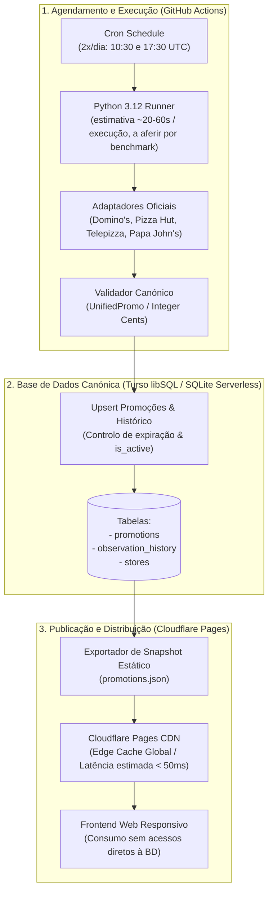

# Arquitetura de Execução, Alojamento, Base de Dados e Publicação — Pizza Radar PT

Este documento detalha a arquitetura técnica global do **Pizza Radar PT**, formalizando as decisões de infraestrutura, a seleção da base de dados com opção gratuita (*free-tier* real), o pipeline de agendamento determinístico, a estratégia de publicação com cache estática e o plano de portabilidade/saída de fornecedores.

---

## 1. Visão Geral da Arquitetura

O sistema adota uma arquitetura desacoplada, orientada a eventos periódicos e com separação estrita entre a camada de persistência/histórico (Base de Dados ACID) e a camada de consumo público (CDN Estática Global de alto desempenho):



---

## 2. Escolha e Racional dos Componentes de Infraestrutura

### 2.1. Alojamento Frontend: Cloudflare Pages
- **Decisão:** **Cloudflare Pages** para alojamento da aplicação web e distribuição estática.
- **Racional Técnico:**
  - **Free Tier sem Restrições Comerciais:** Disponibiliza largura de banda ilimitada, 500 builds por mês e tráfego ilimitado de requisições estáticas. Diferencia-se positivamente do Vercel Hobby (cujos Termos de Serviço restringem o uso estritamente a fins pessoais e não-comerciais).
  - **Edge Anycast Global:** Distribuição imediata em mais de 300 cidades mundiais (incluindo Lisboa), com estimativa de carregamento rápido (da ordem de sub-50ms no edge cache, a validar empiricamente com benchmarks reais de rede).
  - **SSL e Domínios Personalizados Gratuitos:** Suporte nativo para certificados SSL automáticos e configuração de domínio próprio sem custos adicionais.

### 2.2. Base de Dados: Turso (libSQL / SQLite Serverless)
- **Requisito Obrigatório:** O produto deve assentar numa base de dados relacional real para consistência, auditoria e histórico; ficheiros JSON estáticos funcionam como cache de publicação, não como substitutos da base de dados.
- **Avaliação Comparativa de Candidatos com Free Tier:**

| Fornecedor | Quota de Armazenamento | Quota de Operações | Política de Inatividade (Suspensão) | Veredito |
| :--- | :--- | :--- | :--- | :--- |
| **Turso (libSQL)** | **5 GB** | **500M leituras / 10M escritas/mês** | **Sem suspensão por inatividade** (Permanentemente ativa) | **ESCOLHIDO (Primário)** |
| **Supabase (PostgreSQL)** | 500 MB | Limitado por egress (5 GB) | **Pausa obrigatória após 7 dias sem queries SQL** | Rejeitado (risco de paragem do serviço) |
| **Neon (PostgreSQL)** | 500 MB | 100 CU-horas/mês | *Scale-to-zero* após 5 min (cold start de ~500ms) | Alternativa viável / Plano de Saída |
| **Cloudflare D1** | 5 GB | 5M leituras / 100k escritas/dia | Sem suspensão (acoplado a Cloudflare Workers) | Forte acoplamento ao ecossistema |

- **Racional da Escolha do Turso:**
  1. **Ausência de Desativação por Inatividade:** Elimina o problema crítico do Supabase Free, onde projetos são suspensos ao fim de 7 dias sem atividade SQL direta.
  2. **Compatibilidade SQL Padrão e Zero Lock-in:** O Turso utiliza o protocolo libSQL (fork aberto do SQLite). Em desenvolvimento local e na suíte de testes unitários, o sistema utiliza o motor `sqlite3` nativo da biblioteca padrão de Python sem necessidade de qualquer serviço em nuvem.
  3. **Dimensão e Quotas:** 5 GB de armazenamento e 10 milhões de escritas/mês cobrem largamente as necessidades do MVP (~150 promoções ativas em simultâneo, volume anual estimado inferior a 5 MB).
  4. **Particularidades do Cliente Remoto:** O acesso remoto ao Turso exige um cliente libSQL (utilizando o protocolo HTTP/WebSocket do libSQL com token de autenticação `TURSO_AUTH_TOKEN`), ao passo que o desenvolvimento local e os testes correm em `sqlite3` nativo. A portabilidade entre motores é gerida via interface abstrata de repositório (`PromotionRepository`).

### 2.3. Agendamento e Coletores: GitHub Actions
- **Mecanismo:** Workflow acionado por evento cronológico (`schedule: cron '30 10,17 * * *'`) duas vezes ao dia (10:30 UTC e 17:30 UTC), cobrindo os períodos anteriores às refeições de almoço e jantar.
- **Análise Rigorosa de Quotas:**
  - O plano GitHub Free em repositórios privados disponibiliza **2.000 minutos mensais**.
  - **Estimativa de Duração:** Estima-se preliminarmente que cada execução do pipeline demore entre **20 e 60 segundos** (dependendo da latência das APIs externas dos vendedores e da ligação de rede do runner), o que será formalmente aferido através de benchmarks reais na implementação da pipeline.
  - **Estimativa de Consumo:** Com 60 execuções mensais (2x/dia $\times$ 30 dias), o consumo total cifra-se numa estimativa de aproximadamente **20 a 60 minutos por mês** (cerca de **1% a 3% da quota mensal gratuita**), mantendo ampla margem de segurança.

---

## 3. Modelo de Persistência, Atualização e Expiração

### 3.1. Esquema Relacional Canónico (Dialeto SQLite / libSQL)

O esquema relacional canónico é definido em SQL padrão para SQLite/libSQL:

```sql
-- Catálogo de lojas físicas monitorizadas em Lisboa
CREATE TABLE IF NOT EXISTS stores (
    store_id TEXT PRIMARY KEY,
    vendor TEXT NOT NULL,          -- 'DOMINOS', 'PIZZA_HUT', 'TELEPIZZA', 'PAPA_JOHNS'
    name TEXT NOT NULL,
    postal_code TEXT,
    address TEXT,
    is_lisbon_municipality BOOLEAN NOT NULL DEFAULT 1
);

-- Tabela principal de promoções canónicas
CREATE TABLE IF NOT EXISTS promotions (
    id TEXT PRIMARY KEY,
    vendor TEXT NOT NULL,
    title TEXT NOT NULL,
    description TEXT,
    price_cents INTEGER,
    original_price_cents INTEGER,
    discount_percentage REAL,
    discount_type TEXT NOT NULL,
    store_scope TEXT NOT NULL,     -- 'NATIONAL', 'SPECIFIC_STORES', 'UNKNOWN'
    pizza_count INTEGER,
    pizza_size TEXT,
    conditions TEXT,
    valid_from TIMESTAMP,
    valid_until TIMESTAMP,
    observed_at TIMESTAMP NOT NULL,
    last_seen_at TIMESTAMP NOT NULL,
    consecutive_misses INTEGER NOT NULL DEFAULT 0,
    is_active BOOLEAN NOT NULL DEFAULT 1,
    location_scope TEXT NOT NULL DEFAULT 'Lisboa',
    source_url TEXT,
    image_url TEXT,
    raw_payload_json TEXT
);

-- Lojas associadas a promoções específicas
CREATE TABLE IF NOT EXISTS promotion_stores (
    promotion_id TEXT NOT NULL,
    store_id TEXT NOT NULL,
    PRIMARY KEY (promotion_id, store_id),
    FOREIGN KEY (promotion_id) REFERENCES promotions(id) ON DELETE CASCADE,
    FOREIGN KEY (store_id) REFERENCES stores(store_id)
);

-- Histórico de observações e auditoria de preços
CREATE TABLE IF NOT EXISTS observation_history (
    id INTEGER PRIMARY KEY AUTOINCREMENT,
    promotion_id TEXT NOT NULL,
    observed_at TIMESTAMP NOT NULL,
    price_cents INTEGER,
    original_price_cents INTEGER,
    is_available BOOLEAN NOT NULL,
    FOREIGN KEY (promotion_id) REFERENCES promotions(id)
);

-- Índices de consulta
CREATE INDEX IF NOT EXISTS idx_promotions_active ON promotions(is_active, vendor);
CREATE INDEX IF NOT EXISTS idx_promotions_observed ON promotions(observed_at);
```

### 3.2. Ciclo de Vida e Política Determinística de Expiração

1. **Deteção e Atualização (Upsert):**
   - Ao executar, o coletor compara a chave única da promoção (`id`).
   - Se já existir:
     - Atualiza `last_seen_at` para o timestamp atual;
     - Redefine `consecutive_misses = 0`;
     - Preserva o carimbo `observed_at` original (data da primeira observação);
     - Se os preços tiverem sofrido alteração, atualiza os campos e regista nova entrada em `observation_history`.
   - Se a oferta foi anteriormente marcada como inativa e reapareceu na fonte, é reativada (`is_active = 1`, `consecutive_misses = 0`).

2. **Expiração por Data Anunciada:**
   - Se `valid_until` estiver preenchida e for anterior ao horário da execução (`datetime.now(timezone.utc)`), a oferta transita deterministicamente para `is_active = 0`.

3. **Regra Estrita de Tolerância a Falhas e Incremento de Ausências (`consecutive_misses`):**
   - **Uma falha de rede ou parsing de um vendedor NÃO conta como ausência das suas promoções:** Se o coletor da Domino's, Pizza Hut, Telepizza ou Papa John's falhar (ex.: `NetworkError`, timeout, resposta HTTP 5xx ou alteração de HTML provocando `ParseError`), o pipeline regista o erro no log estruturado e **não altera** as promoções desse vendedor.
   - **Contador Condicional:** O contador `consecutive_misses` **só é incrementado quando a recolha desse vendedor específico terminar comprovadamente com sucesso** e a promoção em causa não constar do lote recolhido.
   - **Assimetria de Horários:** As sincronizações agendadas (10:30 UTC e 17:30 UTC) têm intervalos assimétricos: decorrem 7 horas entre a recolha do almoço e a do jantar, e 17 horas entre o jantar e o almoço do dia seguinte. Assim, o critério de expiração por descontinuação baseia-se em **sincronizações consecutivas com sucesso** (ex.: `consecutive_misses >= 2`) e não numa contagem rígida de "24 horas".
   - Quando `consecutive_misses` atinge o limiar configurado (ex.: $\ge 2$), a oferta é desativada (`is_active = 0`).

---

## 4. Estratégia de Publicação e Desempenho

Para conciliar a necessidade de uma base de dados relacional completa com uma experiência de navegação pública rápida e com custo zero:

1. **Geração do Snapshot Estático (`promotions.json`):**
   - No final de cada sincronização bem-sucedida, o script de pipeline consulta a base de dados:
     ```sql
     SELECT * FROM promotions WHERE is_active = 1 AND location_scope = 'Lisboa' ORDER BY vendor, price_cents;
     ```
   - O resultado é serializado como um ficheiro JSON estruturado e determinístico com metadados de execução:
     ```json
     {
       "generated_at": "2026-09-28T17:30:00+00:00",
       "location_scope": "Lisboa",
       "total_promotions": 54,
       "promotions": [ ... ]
     }
     ```

2. **Mecanismo Concreto de Publicação no Cloudflare Pages:**
   - **Sem Ficheiros Gerados na Branch `main`:** O ficheiro `promotions.json` **não é comitado manualmente nem adicionado ao histórico git na `main`**, evitando poluição do repositório, conflitos concorrentes de merge e overhead de histórico git.
   - **Publicação Direta via CI:** O runner do GitHub Actions publica o diretório de saída diretamente para o Cloudflare Pages através da ação oficial (ex.: `cloudflare/wrangler-action` ou `wrangler pages deploy <diretório>`).
   - **Autenticação Segura via GitHub Secrets:** O deploy autentica-se através de secrets de repositório no GitHub:
     - `CLOUDFLARE_API_TOKEN`: Token de API com permissão de edição de Cloudflare Pages;
     - `CLOUDFLARE_ACCOUNT_ID`: Identificador da conta Cloudflare.
   - **Delimitação de Tarefa:** A configuração final do workflow, wiring dos secrets e criação de scripts de deploy ficam a cargo do ticket de automação da pipeline (#12). Não são criadas contas, tokens ou deploys nesta fase de arquitetura.

3. **Consumo no Frontend Web:**
   - O cliente web efetua um único fetch HTTP a `/data/promotions.json`.
   - **Vantagem Operacional:** Zero consultas à base de dados por parte dos utilizadores finais. A BD Turso apenas recebe leituras e escritas durante as 2 sincronizações diárias agendadas.

---

## 5. Observabilidade, Resiliência e Tolerância a Falhas

1. **Notificação de Erros sem Custos:**
   - Alertas nativos por email do GitHub Actions aquando de falhas de jobs agendados.
2. **Isolamento de Falhas por Operador:**
   - Se o site de um operador estiver inacessível, o coletor levanta `NetworkError` ou `ParseError`.
   - O coletor regista o erro e prossegue a execução dos restantes vendedores. As promoções do vendedor com falha permanecem ativas na base de dados (o contador `consecutive_misses` não é alterado).
3. **Comportamento em Falha da Base de Dados (Ausência de Falso Fallback Local Durável):**
   - O sistema de ficheiros do GitHub Actions runner é **efémero e descartado** no término do workflow.
   - Se a base de dados Turso estiver inacessível ou falhar a transação:
     - O runner **não tenta persistência em ficheiro local como mecanismo de recuperação durável**, pois o ficheiro seria perdido com o encerramento do runner;
     - O runner **não altera estados de ofertas nem publica snapshots parciais ou corrompidos** para o Cloudflare Pages, preservando integralmente o último snapshot íntegro na CDN;
     - O erro é registado nos logs com contexto detalhado e a execução termina com código de erro;
     - Artefactos locais gerados durante a execução (ex.: logs de diagnóstico ou JSON de depuração) podem ser preservados temporariamente apenas como artefactos de diagnóstico do GitHub Actions (*workflow run artifacts*), com finalidade exclusiva de depuração;
     - Uma nova tentativa completa de sincronização terá lugar no próximo ciclo agendado.

---

## 6. Orçamento Operacional do MVP (0,00 € / mês)

| Componente | Fornecedor / Serviço | Limite Gratuito Oficial | Consumo Previsto (Estimativas a Validar por Benchmark) | Custo Mensal |
| :--- | :--- | :--- | :--- | :---: |
| **Alojamento Frontend** | Cloudflare Pages | Largura de banda ilimitada, 500 builds/mês | ~50-60 deploys/mês, tráfego < 10 GB | **0,00 €** |
| **Base de Dados** | Turso (libSQL) | 5 GB armazenamento, 10M escritas/mês | < 5 MB armazenamento, < 15k escritas/mês | **0,00 €** |
| **Agendamento CI/CD** | GitHub Actions | 2.000 minutos/mês (repo privado) | ~20 a 60 minutos/mês (~1% a 3% da quota) | **0,00 €** |
| **CDN e Certificado SSL**| Cloudflare Edge | Ilimitado | Cobertura global Anycast | **0,00 €** |
| **Modelos de IA em Runtime**| N/A | Proibição absoluta no produto | 0 chamadas | **0,00 €** |
| **Total Global Estimado**| | | | **0,00 € / mês** |

---

## 7. Portabilidade e Plano de Saída (Vendor Exit Strategy)

A arquitetura prevê planos concretos de saída para mitigar riscos de alterações nos fornecedores:

### 7.1. Plano de Saída da Base de Dados (Turso $\rightarrow$ SQLite Local / PostgreSQL)

A portabilidade entre SGBDs não se obtém apenas alterando uma string de conexão `DATABASE_URL`:
1. **Diferenças de Protocolo e Drivers:**
   - O Turso remoto exige o protocolo libSQL (sobre HTTP/WebSocket) e autenticação com token (`TURSO_AUTH_TOKEN`).
   - O SQLite local utiliza o módulo nativo `sqlite3` da biblioteca padrão em ficheiro de disco.
   - O PostgreSQL (Neon/Supabase) exige um driver de rede específico (ex.: `psycopg` ou `asyncpg`) e autenticação padrão do Postgres.
2. **Divergências de Esquema DDL e Dialeto SQL:**
   - *Chaves Primárias Autoincrementais:* SQLite/libSQL utiliza `INTEGER PRIMARY KEY AUTOINCREMENT`; PostgreSQL utiliza `BIGINT GENERATED ALWAYS AS IDENTITY` ou `BIGSERIAL`.
   - *Tipos Booleanos e Datas:* SQLite armazena booleanos como inteiros (`0` ou `1`) e datas como strings em formato ISO 8601; PostgreSQL possui os tipos nativos `BOOLEAN` e `TIMESTAMPTZ`.
   - *Resolução de Conflitos (Upsert):* Sintaxes de `INSERT INTO ... ON CONFLICT (...) DO UPDATE` possuem particularidades específicas de casting de tipos.
3. **Estratégia de Abstração via Interface (`PromotionRepository`):**
   - O código de negócio nunca chama diretamente primitivas do Turso. Toda a persistência é isolada sob uma interface abstrata:
     ```python
     class PromotionRepository(ABC):
         @abstractmethod
         def upsert_promotions(self, promos: list[UnifiedPromo], vendor: str) -> SyncResult: ...
         @abstractmethod
         def get_active_promotions(self, location_scope: str = "Lisboa") -> list[UnifiedPromo]: ...
         @abstractmethod
         def record_history(self, history_entries: list[ObservationEntry]) -> None: ...
     ```
   - Implementações concretas independentes:
     - `LibSqlPromotionRepository`: Produção com Turso via HTTP client;
     - `SqlitePromotionRepository`: Desenvolvimento local e testes via `sqlite3`;
     - `PostgresPromotionRepository`: Plano de saída alternativo para Neon ou Supabase.
4. **Procedimento de Exportação e Migração de Dados:**
   - Exportação completa dos dados a partir do Turso via dump SQL (`turso db shell <db> .dump`) ou via extração JSON serializada das tabelas `promotions`, `observation_history` e `stores`.
   - Execução do script DDL adaptado ao SGBD de destino.
   - Importação dos dados e comutação da implementação ativa de `PromotionRepository` via configuração.

### 7.2. Plano de Saída do Frontend (Cloudflare Pages $\rightarrow$ Vercel / Netlify / GitHub Pages)
- O frontend gera assets estáticos universais (HTML, CSS, JS).
- A migração para Vercel, Netlify, GitHub Pages ou servidor Nginx/Caddy realiza-se alterando o target de deploy sem reescrever código de frontend.

### 7.3. Plano de Saída do Agendamento (GitHub Actions $\rightarrow$ Servidor Linux / Cron / Docker)
- O pipeline de recolha e sincronização é executável como comando de linha de terminal local:
  ```bash
  python -m pizza_radar.cli sync
  ```
- Pode ser executado em qualquer VPS gratuita (ex.: Oracle Cloud Free Tier), tarefa agendada em crontab ou contentor Docker.

---

## 8. Fontes Oficiais e Data de Verificação de Quotas

Todas as quotas, limites e políticas dos fornecedores avaliados foram confirmadas diretamente na respetiva documentação oficial:

| Fornecedor / Serviço | Documento / Fonte Oficial Consultada | Data de Verificação | Quotas e Regras Confirmadas |
| :--- | :--- | :--- | :--- |
| **Turso (libSQL)** | [Turso Pricing](https://turso.tech/pricing) e [Plan Limits](https://docs.turso.tech/plans) | **2026-09-28** | **5 GB** de armazenamento, **10M de escritas/mês**, **500M de leituras/mês**. Confirmada a **ausência de pausa ou suspensão por inatividade** no plano gratuito. |
| **Cloudflare Pages** | [Cloudflare Pages Limits](https://developers.cloudflare.com/pages/platform/limits/) e [Plans](https://www.cloudflare.com/plans/) | **2026-09-28** | **Largura de banda ilimitada**, **500 builds/mês**, 100 domínios personalizados, requisições estáticas ilimitadas. |
| **GitHub Actions** | [About Billing for GitHub Actions](https://docs.github.com/en/billing/managing-billing-for-your-products/managing-billing-for-github-actions/about-billing-for-github-actions) | **2026-09-28** | **2.000 minutos/mês** gratuitos para contas padrão em repositórios privados (e ilimitado em repositórios públicos). |
| **Supabase** | [Supabase Project Pausing](https://supabase.com/docs/guides/platform/pausing) e [Pricing](https://supabase.com/pricing) | **2026-09-28** | Projetos no plano Free entram em **pausa automática após 7 dias de inatividade** sem queries SQL ou chamadas API diretas. |
